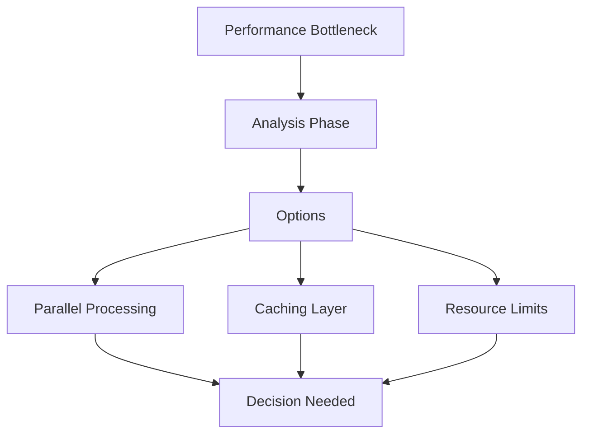

# Active Context: Pre-commit MCP Server

## Current Focus

### Implementation Status
- Basic MCP server structure implemented
- Initial pre-commit hook integration complete
- Basic spell check dictionary management in place
- Documentation framework established

### Recent Changes
1. Core Server Setup
   - Implemented PreCommitServer class
   - Added MCP request handlers
   - Configured basic logging

2. Hook Integration
   - Added run_checks functionality
   - Implemented async execution
   - Added result formatting

3. Dictionary Management
   - Added word addition capability
   - Implemented dictionary file handling
   - Set up basic validation

## Active Decisions

### 1. Performance Optimization


**Context:** Hook execution time needs optimization
- Currently sequential execution
- No caching mechanism
- Unlimited resource usage

**Options Under Consideration:**
1. Parallel Processing
   - Pros: Faster execution
   - Cons: More complex error handling
   - Status: Under evaluation

2. Caching Layer
   - Pros: Reduced redundant checks
   - Cons: Cache invalidation complexity
   - Status: Researching approaches

3. Resource Limits
   - Pros: Predictable performance
   - Cons: Potential false timeouts
   - Status: Defining limits

### 2. Dictionary Storage
Current Approach: File-based storage
Considering:
- SQLite for better atomic operations
- Redis for improved performance
- Hybrid approach for reliability

### 3. Error Handling Strategy
Working on standardized error response format:
```json
{
  "status": "error",
  "code": "ERR_HOOK_EXECUTION",
  "message": "Hook execution failed",
  "context": {
    "hook": "black",
    "files": ["main.py"],
    "error": "Timeout after 30s"
  }
}
```

## Next Steps

### Immediate Tasks
1. [ ] Implement parallel hook execution
2. [ ] Add caching layer for check results
3. [ ] Define and implement resource limits
4. [ ] Complete error handling standardization

### Upcoming Decisions
1. Dictionary storage mechanism
2. Cache invalidation strategy
3. Performance monitoring approach
4. Testing framework selection

### Documentation Needs
1. [ ] Update performance requirements
2. [ ] Document caching strategy
3. [ ] Create error handling guide
4. [ ] Add dictionary management specs

## Open Questions
1. Maximum concurrent hook executions?
2. Cache TTL for different check types?
3. Dictionary update conflict resolution?
4. Performance metric collection method?
