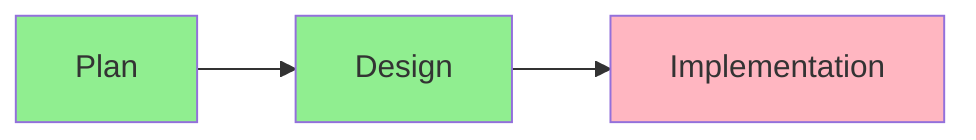

# Progress Tracking: Pre-commit MCP Server

## Completed Features

### Core Infrastructure
- [x] Basic MCP server setup
- [x] Request handler framework
- [x] Basic logging implementation
- [x] Error handling structure

### Pre-commit Integration
- [x] Basic hook execution
- [x] File validation
- [x] Result formatting
- [x] Git integration

### Dictionary Management
- [x] Basic word addition
- [x] Dictionary file handling
- [x] Language support structure

## In Progress

### Performance Optimization

- [x] Analysis complete
- [x] Design documentation
- [ ] Parallel execution
- [ ] Caching layer
- [ ] Resource limits

### Dictionary Enhancements

- [x] Storage options research
- [ ] Storage mechanism design
- [ ] Conflict resolution
- [ ] Multi-language support

## Pending Tasks

### Core Features
1. High Priority
   - [ ] Parallel hook execution
   - [ ] Result caching
   - [ ] Resource management
   - [ ] Error standardization

2. Medium Priority
   - [ ] Dictionary storage optimization
   - [ ] Performance monitoring
   - [ ] Configuration validation
   - [ ] Hook timeout management

3. Low Priority
   - [ ] Advanced logging
   - [ ] Metrics collection
   - [ ] Admin interface
   - [ ] Custom hook support

### Testing
- [ ] Unit test suite
- [ ] Integration tests
- [ ] Performance benchmarks
- [ ] Load testing

### Documentation
- [ ] API documentation
- [ ] Hook configuration guide
- [ ] Dictionary management guide
- [ ] Troubleshooting guide

## Known Issues

### Performance
1. Sequential hook execution
   - Impact: High
   - Status: Design complete
   - Solution: Parallel execution

2. No result caching
   - Impact: Medium
   - Status: Researching
   - Solution: Redis/SQLite integration

### Functionality
1. Limited dictionary management
   - Impact: Medium
   - Status: In design
   - Solution: Enhanced storage system

2. Basic error handling
   - Impact: Medium
   - Status: In progress
   - Solution: Standardized error system

## Next Release Goals

### v0.2.0
- Parallel hook execution
- Basic result caching
- Resource limits
- Standardized errors

### v0.3.0
- Enhanced dictionary management
- Performance monitoring
- Advanced configuration
- Comprehensive testing