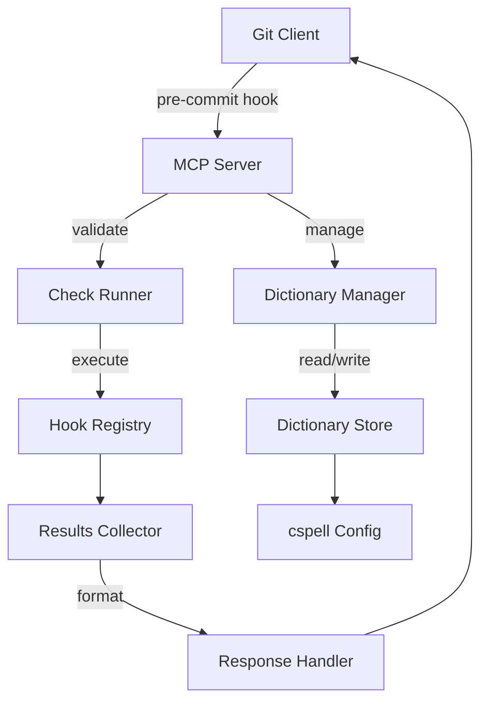
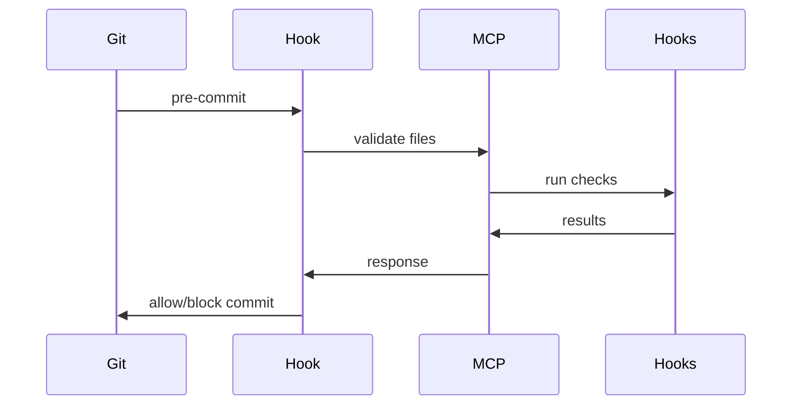
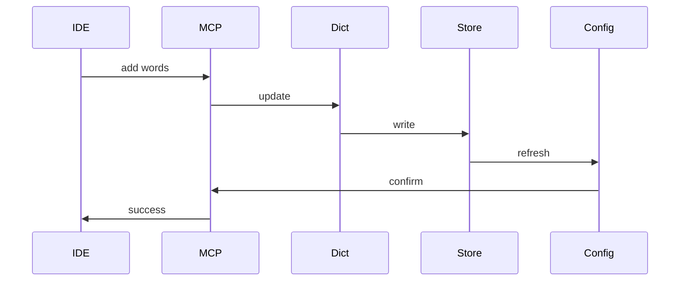

# System Patterns: Pre-commit MCP Server

## Core Architecture

## Component Design

### 1. MCP Server Layer
- Responsibility: Protocol handling and request routing
- Pattern: Command pattern for tool execution
- Key Decisions:
  * Async execution for performance
  * Standardized error handling
  * Typed request/response schemas

### 2. Check Runner
- Responsibility: Hook execution management
- Pattern: Strategy pattern for different checks
- Key Decisions:
  * Parallel execution where possible
  * Timeout management
  * Resource limiting

### 3. Dictionary Manager
- Responsibility: Spell check dictionary operations
- Pattern: Repository pattern for dictionary access
- Key Decisions:
  * File-based storage
  * Language-specific dictionaries
  * Custom word lists

## Integration Patterns

### 1. Git Integration

### 2. Dictionary Updates

## Error Handling

1. Validation Errors
   - Clear error messages
   - Fix suggestions where possible
   - Error categories for filtering

2. System Errors
   - Graceful degradation
   - Detailed logging
   - Automatic retry for transient issues

3. Dictionary Errors
   - Backup on write
   - Validation before save
   - Conflict resolution

## Performance Patterns

1. Caching
   - Dictionary cache
   - Hook results cache
   - Configuration cache

2. Async Operations
   - Parallel hook execution
   - Non-blocking I/O
   - Background dictionary updates

3. Resource Management
   - Worker pool for checks
   - Memory limits for operations
   - Timeout controls

## Security Patterns

1. Input Validation
   - File path sanitization
   - Dictionary entry validation
   - Command injection prevention

2. Access Control
   - Hook execution isolation
   - Dictionary write protection
   - Configuration access control