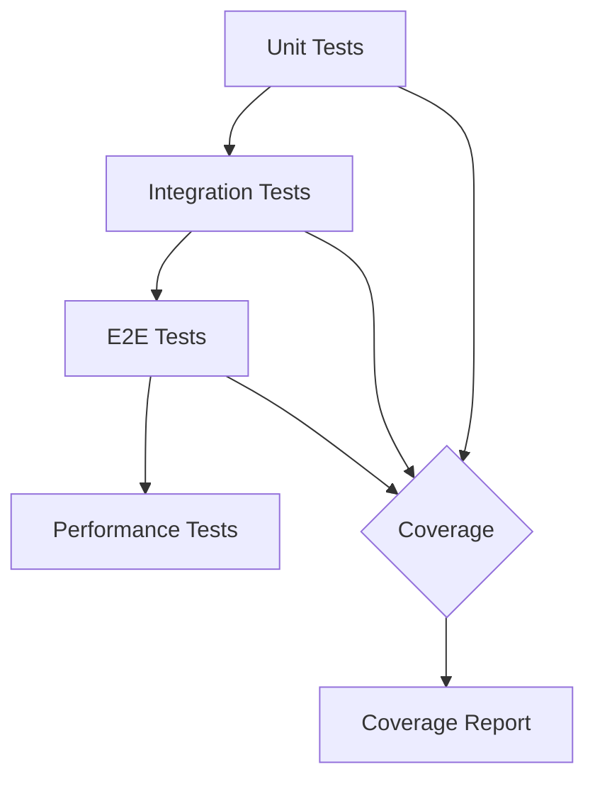
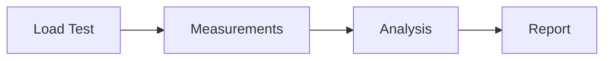

# Test Strategy: Pre-commit MCP Server

## Testing Philosophy

### Goals
1. Ensure reliable hook execution
2. Validate dictionary management
3. Verify performance requirements
4. Confirm error handling

### Principles
- Test-driven development
- Comprehensive coverage
- Automated testing
- Performance validation

## Test Categories



### 1. Unit Tests
- Hook execution logic
- Dictionary management
- Configuration handling
- Error handling

### 2. Integration Tests
- MCP protocol compliance
- Git hook integration
- Dictionary storage
- Cache system

### 3. E2E Tests
- Complete commit workflow
- Dictionary updates
- Configuration changes
- Error scenarios

### 4. Performance Tests
- Hook execution timing
- Dictionary operation speed
- Resource usage monitoring
- Concurrent operation handling

## Test Implementation

### Test Framework
```python
import pytest
import asyncio
from unittest.mock import Mock, patch

@pytest.fixture
async def server():
    server = PreCommitServer()
    await server.initialize()
    yield server
    await server.cleanup()

@pytest.mark.asyncio
async def test_hook_execution(server):
    result = await server.run_checks(["test.py"])
    assert result["status"] == "success"
```

### Coverage Requirements
- Business Logic: 95%
- Error Handling: 100%
- Integration Points: 90%
- Overall: >90%

## Test Scenarios

### 1. Hook Validation
- Single file changes
- Multiple file changes
- Various file types
- Invalid files
- Timeout conditions

### 2. Dictionary Operations
- Word addition
- Language selection
- Conflict resolution
- Invalid inputs
- Concurrent updates

### 3. Performance Validation


#### Metrics
- Hook execution time
- Dictionary operation latency
- Memory usage
- CPU utilization

#### Thresholds
- Hook execution: <2s
- Dictionary updates: <500ms
- Memory usage: <200MB
- CPU usage: <50%

## Continuous Testing

### CI/CD Integration
1. Pre-merge Checks
   - Unit tests
   - Integration tests
   - Coverage validation
   - Performance checks

2. Nightly Tests
   - E2E test suite
   - Long-running tests
   - Load testing
   - Memory leak checks

### Monitoring
- Test execution metrics
- Coverage trends
- Performance trends
- Error rates

## Test Documentation

### Required Documents
1. Test Plans
   - Scenario descriptions
   - Expected results
   - Test data
   - Environment setup

2. Test Reports
   - Execution results
   - Coverage analysis
   - Performance metrics
   - Issue tracking

### Maintenance
- Regular review cycle
- Update with new features
- Performance baseline updates
- Test data maintenance