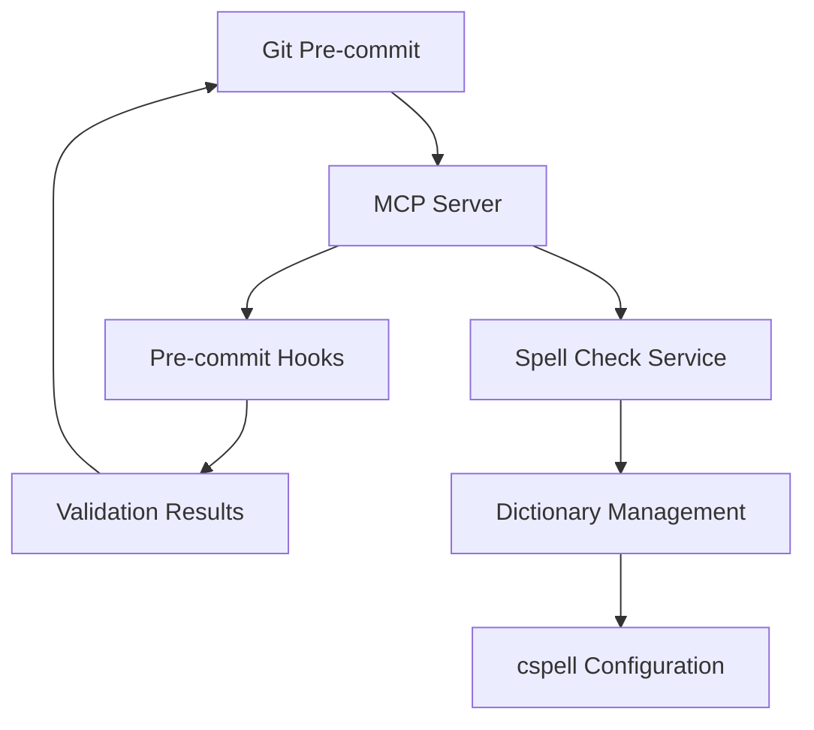

# pre-commit for Model Context Protocol (MCP)

## Project Overview

A Python-based MCP server that integrates with git pre-commit hooks to provide code quality checks and spell checking capabilities. This server enables automated validation of code changes before commits while leveraging the Model Context Protocol for enhanced functionality.

## Core Features

1. Pre-commit Hook Integration
   - Seamless integration with git pre-commit framework
   - MCP-based hook execution and reporting
   - Support for multiple validation types
   - Asynchronous execution for improved performance

2. Spell Check Management
   - Multi-language dictionary support
   - Custom dictionary management
   - Word addition and removal capabilities
   - Integration with cspell configuration

## System Architecture

## Technical Requirements

1. Performance
   - Asynchronous execution of checks
   - Efficient dictionary management
   - Quick response times for validation

2. Integration
   - MCP SDK compliance
   - Git pre-commit hook compatibility
   - cspell dictionary format support

3. Error Handling
   - Comprehensive logging
   - Clear error messages
   - Graceful failure handling

## Implementation Status

- [x] Basic MCP server setup
- [x] Pre-commit hook integration
- [x] Spell check dictionary management
- [ ] Performance optimization
- [ ] Comprehensive test coverage
- [ ] Documentation completion

## Next Steps

1. Complete core functionality implementation
2. Add comprehensive testing
3. Optimize performance
4. Enhance documentation
5. Create user guides
