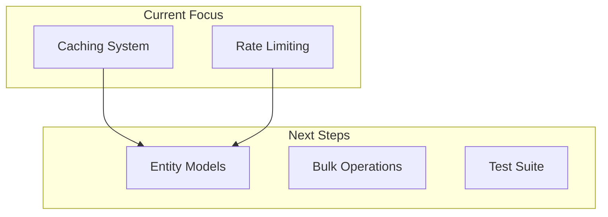
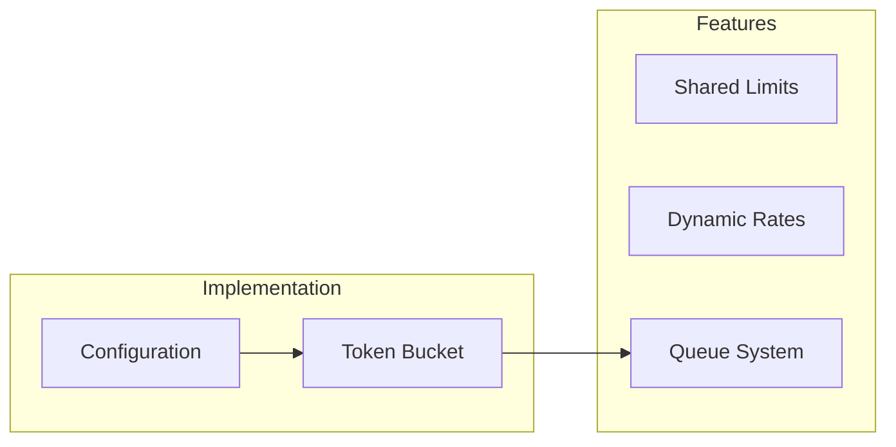

# Zabbix Server API - Active Context

## Current Implementation Status

### Core Components
- [x] Basic project structure
- [x] Base API client
- [x] Authentication handling
- [x] Host model implementation
- [ ] Rate limiting system
- [ ] Caching layer
- [ ] Additional entity models

### Active Development

## Recent Architectural Decisions

### Rate Limiting Design

### Caching Strategy
- Memory cache for high-frequency data
- Intelligent cache warming
- Configurable TTL per entity
- Cache invalidation on updates

## Active Decisions

### Rate Limiting Implementation
- Using token bucket algorithm
- Configurable limits per endpoint
- Automatic request queuing
- Circuit breaker pattern

### Caching Approach
- Memory cache implementation
- TTL-based invalidation
- Cache warming strategy

### Error Handling
- Enhanced error context
- Rate limit notifications
- Cache miss tracking
- Circuit breaker implementation
- Detailed logging

## Next Steps

### Priority 1: Rate Limiting
1. Implement token bucket
2. Add configuration system
3. Create request queue
4. Add monitoring

### Priority 2: Caching
1. Set up cache structure
2. Implement TTL management
3. Add invalidation rules
4. Create warming system

## Known Issues

### Rate Limiting
- Queue overflow handling
- Circuit breaker thresholds
- Recovery strategies
- Monitoring system

### Testing
- Rate limit testing
- Cache behavior tests
- Integration test suite
