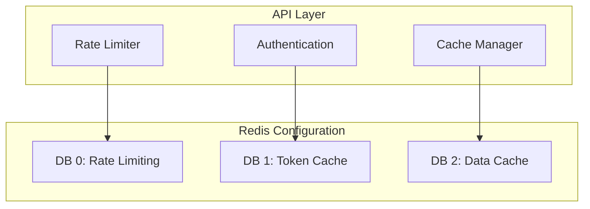

# ADR 001: Redis Integration for Caching and Rate Limiting

## Status
Accepted

## Context
The Zabbix Server API requires robust caching and rate limiting capabilities to:
- Prevent excessive load on the Zabbix server
- Improve response times
- Manage authentication tokens
- Support distributed deployments

## Decision
We will implement Redis as a centralized solution for both caching and rate limiting, with the following architecture:

### Key Components
1. Token Bucket Algorithm for Rate Limiting
   - Configurable limits per endpoint
   - Redis-backed counters
   - Automatic bucket refill
   - Request queuing support

2. Two-Tier Caching Strategy
   - Local memory cache for high-frequency data
   - Redis cache for shared/distributed data
   - TTL-based invalidation
   - Cache warming support

3. Health Monitoring
   - Redis connection monitoring
   - Memory usage tracking
   - Error rate monitoring
   - Performance metrics collection

## Consequences

### Positive
- Centralized rate limiting across instances
- Distributed caching support
- Improved scalability
- Better performance monitoring
- Simplified token management

### Negative
- Additional infrastructure dependency
- Increased operational complexity
- Need for Redis expertise
- Memory management overhead

### Mitigations
1. Connection Management
   - Connection pooling
   - Automatic reconnection
   - Circuit breaker pattern
   - Fallback mechanisms

2. Data Persistence
   - Regular snapshots
   - AOF persistence
   - Backup strategy
   - Recovery procedures

3. Memory Management
   - TTL-based expiration
   - Memory limits per DB
   - Monitoring alerts
   - Eviction policies

## Implementation Plan

### Phase 1: Basic Integration
1. Redis container setup
2. Connection management
3. Basic health checks
4. Error handling

### Phase 2: Rate Limiting
1. Token bucket implementation
2. Configuration system
3. Request queuing
4. Monitoring setup

### Phase 3: Caching
1. Cache structure
2. TTL management
3. Invalidation rules
4. Warming system

## Alternatives Considered

### Alternative 1: In-Memory Solutions
- Pros:
  * Simpler implementation
  * No external dependencies
  * Lower latency
- Cons:
  * No distributed support
  * Limited scalability
  * Memory constraints
  * No persistence

### Alternative 2: Separate Services
- Pros:
  * Better separation of concerns
  * Independent scaling
  * Specialized solutions
- Cons:
  * More complex infrastructure
  * Higher operational overhead
  * Multiple points of failure
  * Increased costs

## References
- [Redis Documentation](https://redis.io/documentation)
- [Token Bucket Algorithm](https://en.wikipedia.org/wiki/Token_bucket)
- [Circuit Breaker Pattern](https://martinfowler.com/bliki/CircuitBreaker.html)
