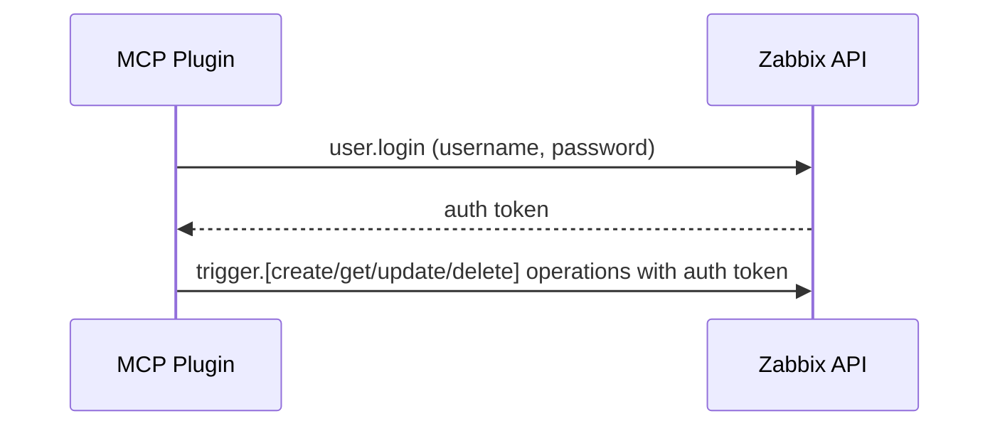
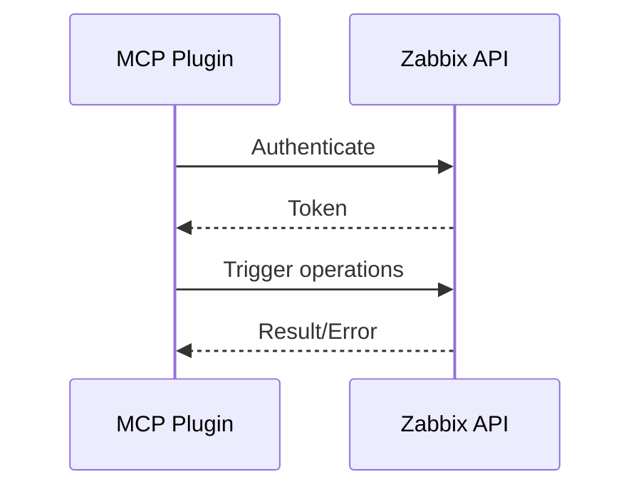

# MCP Plugin Development Plan: Zabbix Trigger API Integration

---

## Step 1: Planning Phase — Problem Definition and Approach

### Problem Statement
This MCP plugin's objective is to allow streamlined and structured interactions with the Zabbix Trigger API. Triggers within Zabbix determine events and alerts based on monitored item metrics. Currently, trigger management may be manual or fragmented in different workflows, leading to complexity and higher error potential, where automation will be beneficial.

### Goals
- Complete integration with the Zabbix Trigger API via MCP plugin in Python.
- Automate trigger management operations.
- Provide robust logging and error-handling features.

---

## Zabbix Trigger API Overview
The integration will comprehensively cover the Trigger-related operations:

- **Creation** (`trigger.create`)
- **Retrieval** (`trigger.get`)
- **Updating** (`trigger.update`)
- **Deletion** (`trigger.delete`)
- **Dependencies Management**

Given a lack of existing Trigger documentation, official Zabbix API documentation will guide implementation.

---

## Authentication Strategy
Utilizing standard Zabbix API authentication:

### Authentication Flow


---

## Step 2: Technical Design and Implementation Phase

#### Implementation Roadmap (incremental approach):

1. **Set up Python Project Environment**
```bash
pip install mcp
# Recommended alternative with UV
uv add "mcp[cli]"
```

2. **Core Implementation of Trigger API Methods**
Methods to be wrapped:
- trigger.create
- trigger.get
- trigger.update
- trigger.delete
- Dependencies management

#### Trigger Management Flow:


#### Comprehensive Logging & Error Handling
```python
import logging
logging.basicConfig(level=logging.ERROR)

def manage_trigger(client, method, params):
    logging.error('[Setup] Initializing Trigger API call...')
    try:
        response = client.call_method(method, params)
        logging.error(f'[API] Request Params: {params}')
        logging.error(f'[API] Response Data: {response}')
        return response
    except Exception as error:
        logging.error(f'[Error] Trigger operation failed: {str(error)}')
        raise
```

#### MCP Configuration (Python SDK):
```json
{
  "mcpServers": {
    "zabbix-trigger-plugin": {
      "command": "python",
      "args": ["server_trigger.py"],
      "env": {
        "ZABBIX_URL": "url_here",
        "ZABBIX_USER": "user_here",
        "ZABBIX_PASSWORD": "password_here"
      },
      "disabled": false,
      "autoApprove": []
    }
  }
}
```

---

## Testing Strategy
Rigorous tests required prior to completion:
- Authentication validation.
- CRUD operations for triggers.
- Dependencies detection and management.
- Error tests: invalid tokens, incorrect parameters, network issues.
- Validate responses against the official Zabbix schema.

---

## High-Level Architecture Diagram
```mermaid
graph LR
User-->MCP_Plugin[MCP Plugin: Python SDK]
MCP_Plugin-->ZabbixAPI[Zabbix API Auth]
MCP_Plugin-->Trigger_Create[Create Trigger]
MCP_Plugin-->Trigger_Get[Retrieve Triggers]
MCP_Plugin-->Trigger_Update[Update Trigger]
MCP_Plugin-->Trigger_Delete[Delete Trigger]
MCP_Plugin-->Trigger_Dep[Manage Dependencies]
ZabbixAPI-->MCP_Plugin