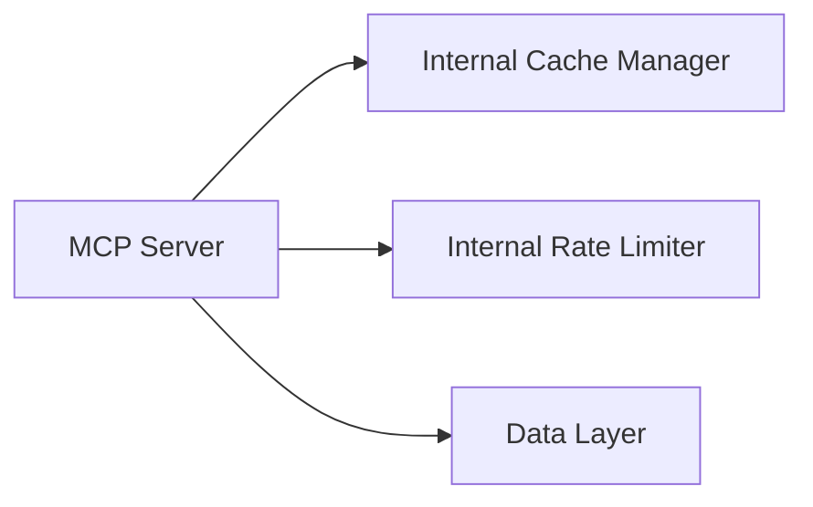

# Memory Bank Update Plan for Zabbix Server API

This document outlines the specific updates needed for the removal of all Redis references from the Memory Bank documentation.

## Files and Steps to Update

### 1. activeContext.md
- Remove Redis from "Core Components."
- Update Mermaid diagram to exclude Redis node.
  ```mermaid
  flowchart TD
      subgraph Current[Current Focus]
          Rate[Rate Limiting]
          Cache[Caching System]
      end

      subgraph Next[Next Steps]
          Models[Entity Models]
          Bulk[Bulk Operations]
          Testing[Test Suite]
      end

      Rate --> Models
      Cache --> Models
```
- Delete "Redis Integration" from "Recent Architectural Decisions," "Active Decisions," "Next Steps," and "Known Issues."

### 2. productContext.md
- Validate and remove any Redis reference if present.

### 3. progress.md
- Remove Redis integration entries from Gantt Timeline, "In Progress," "Upcoming Work," and "Known Issues".

**Updated Gantt (Example):**
```mermaid
section Current Phase
Rate Limiting         :active,   rate,      2025-03-05, 3d
Caching System        :active,   cache,     2025-03-06, 3d
```

### 3. systemPatterns.md
- Remove Redis references from architecture and patterns diagrams:

- Update sequence diagrams to omit Redis interactions explicitly.

### 4. techContext.md
- Remove Redis from dependencies, setup, and Docker configuration:
  - Adjust core dependencies.
  - Remove Redis Docker setup instructions.
  - Adjust Environment Variables.

Updated environment setup snippet:
```
# Environment Variables without Redis
RATE_LIMIT_REQUESTS=100
RATE_LIMIT_PERIOD=60
RATE_LIMIT_BUCKET_SIZE=10
CACHE_TTL=300
TOKEN_CACHE_TTL=3600
```

Adjusted Dockerfile snippet:
```dockerfile
FROM python:3.8-slim

WORKDIR /app
COPY . .
RUN poetry install --no-dev

CMD ["python", "src/main.py"]
```

## Verification Steps:
- Thoroughly review each file to ensure all Redis references have been removed.

## Next Steps
- Review markdown file changes.
- Switch to Code mode to implement these updates systematically.
