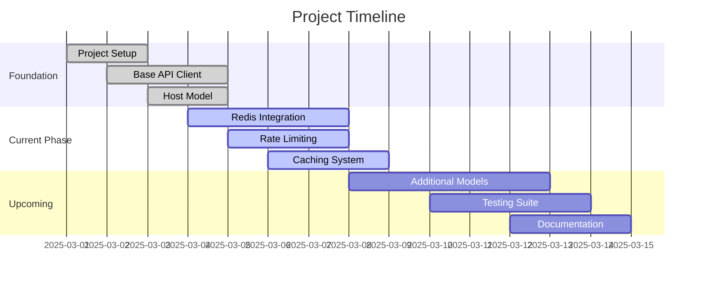
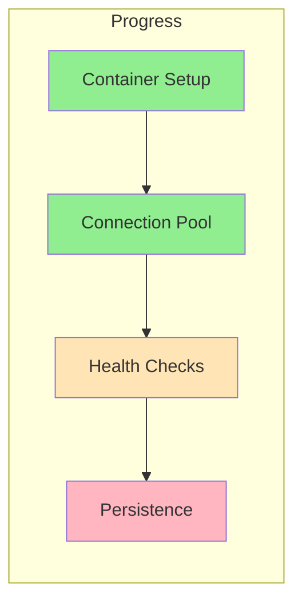
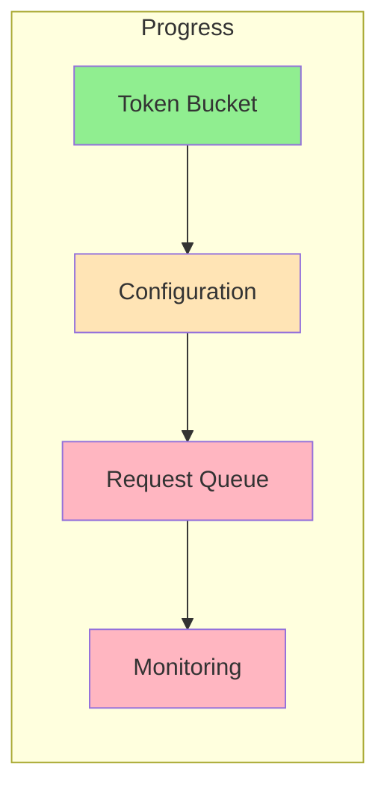
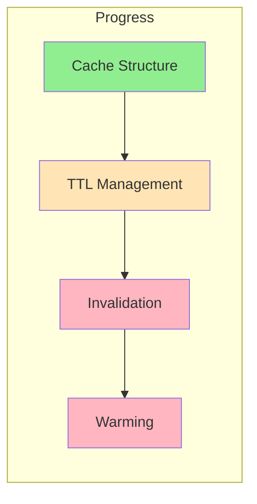

# Zabbix Server API - Progress Tracking

## Project Status Overview

## Completed Features

### Core Infrastructure
- [x] Project initialization
- [x] Basic directory structure
- [x] Development environment setup
- [x] CI/CD pipeline configuration

### API Integration
- [x] Base API client
- [x] Authentication system
- [x] Error handling framework
- [x] Request/response validation

### Entity Support
- [x] Host model implementation
- [x] Basic CRUD operations
- [x] Data validation
- [x] Error mapping

## In Progress

### Redis Integration

- [x] Redis container setup
- [x] Connection pooling
- [ ] Health monitoring
- [ ] Persistence configuration

### Rate Limiting

- [x] Token bucket algorithm
- [ ] Configuration system
- [ ] Request queuing
- [ ] Monitoring system

### Caching System

- [x] Cache structure design
- [ ] TTL management
- [ ] Cache invalidation
- [ ] Cache warming

## Upcoming Work

### Priority Tasks
1. Complete Redis integration
   - Finish health monitoring
   - Implement persistence
   - Add failover support

2. Finish rate limiting
   - Complete configuration system
   - Implement request queue
   - Add monitoring

3. Complete caching system
   - Implement TTL management
   - Add invalidation rules
   - Set up cache warming

### Secondary Tasks
1. Additional entity models
   - Items implementation
   - Triggers support
   - Templates handling
   - Groups management

2. Testing infrastructure
   - Unit test framework
   - Integration tests
   - Performance benchmarks
   - Load testing

## Known Issues

### Critical
1. Redis Integration
   - Need connection retry logic
   - Memory monitoring required
   - Backup strategy needed

2. Rate Limiting
   - Queue overflow handling
   - Circuit breaker implementation
   - Recovery procedures

3. Caching
   - Memory management
   - Invalidation coordination
   - Warm-up strategy

### Non-Critical
1. Documentation
   - API examples needed
   - Setup guide incomplete
   - Missing troubleshooting guide

2. Testing
   - Limited coverage
   - Missing integration tests
   - Need performance metrics

## Next Actions
1. Implement Redis health monitoring
2. Complete rate limit configuration
3. Add cache TTL management
4. Create monitoring dashboard
5. Document Redis operations
6. Set up test environment
