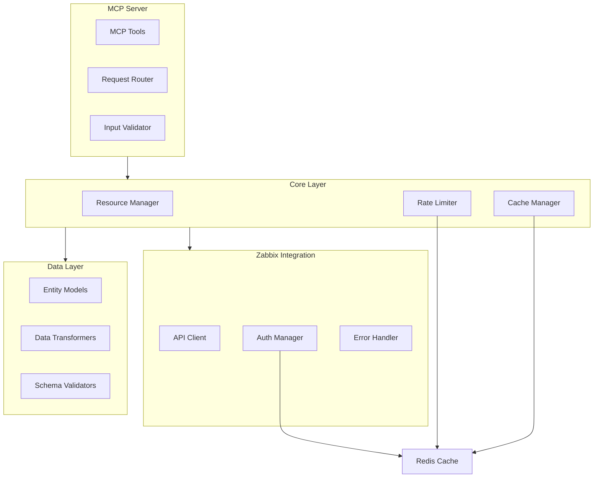
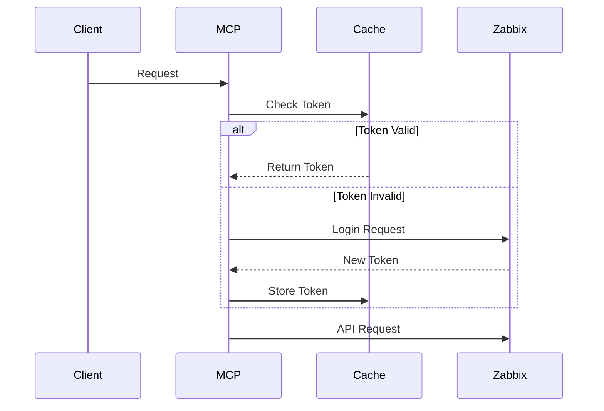
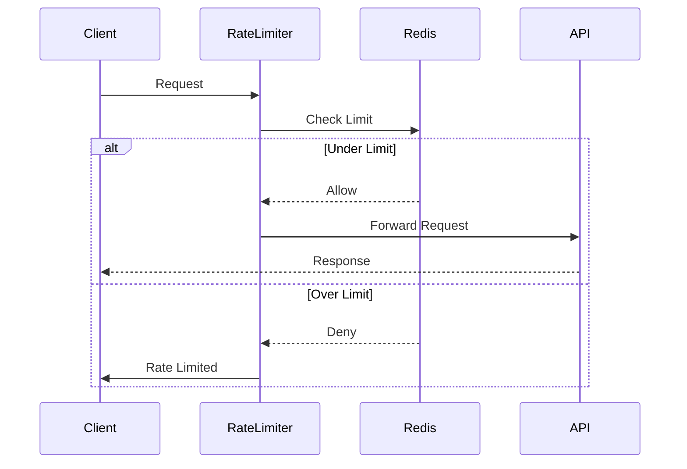

# Zabbix Server API - System Patterns

## Architecture Overview

## Core Design Patterns

### Repository Pattern
- Abstracts Zabbix API interactions
- Provides clean interface for entity operations
- Centralizes data access logic
- Enables easy testing and mocking

### Adapter Pattern
- Converts between MCP and Zabbix data structures
- Handles API versioning differences
- Provides consistent interface
- Isolates changes to external API

### Factory Pattern
- Creates entity instances from API responses
- Handles complex object initialization
- Centralizes object creation logic
- Ensures consistency in object creation

### Command Pattern
- Encapsulates API operations
- Standardizes request handling
- Enables operation queueing
- Facilitates rate limiting

### Strategy Pattern
- Pluggable rate limiting algorithms
- Configurable caching strategies
- Adaptable authentication methods
- Flexible error handling approaches

## Implementation Patterns

### Authentication Flow

### Rate Limiting Flow

### Request Processing
1. Validation Layer
   - Schema validation
   - Parameter sanitization
   - Rate limit checking
   - Authentication verification

2. Error Handling
   - Structured error responses
   - Detailed error logging
   - Recovery strategies
   - Circuit breaking

3. Response Processing
   - Data transformation
   - Response validation
   - Cache management
   - Rate limit updates

## Data Patterns

### Entity Models
1. Base Model Properties
   - ID fields
   - Creation timestamps
   - Update timestamps
   - Status indicators

2. Relationships
   - Host to Items
   - Host to Templates
   - Template to Items
   - Group memberships

### Caching Strategy
1. Token Caching
   - Short-lived authentication tokens
   - Automatic refresh
   - Secure storage
   - Multi-server support

2. Data Caching
   - Entity-level caching
   - Cache invalidation rules
   - TTL management
   - Memory limits

## Integration Patterns

### MCP Tool Design
1. Tool Structure
   - Clear purpose
   - Consistent naming
   - Input validation
   - Error handling

2. Response Format
   - Standard structure
   - Error details
   - Performance metrics
   - Debug information

### Error Handling
1. Error Categories
   - Authentication errors
   - Validation errors
   - API errors
   - System errors

2. Recovery Strategies
   - Automatic retry
   - Fallback options
   - Circuit breaking
   - Graceful degradation
