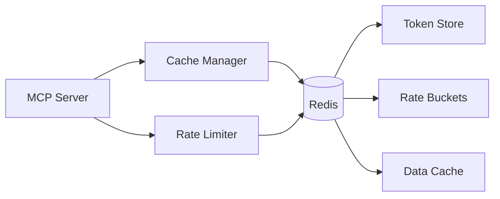

# Zabbix Server API - Technical Context

## Technology Stack

### Core Dependencies
- Python 3.8+
- MCP SDK (`@modelcontextprotocol/sdk`)
- Requests library (HTTP client)
- Pydantic (data validation)
- Redis (caching and rate limiting)
- Python-dotenv (environment management)

### Development Tools
- Poetry (dependency management)
- Black (code formatting)
- MyPy (type checking)
- Pytest (testing)
- Pre-commit hooks

## Development Environment

### Setup Requirements
```bash
# Core installation
poetry install

# Redis setup
docker run -d --name zabbix-cache \
  -p 6379:6379 \
  redis:alpine

# Development dependencies
poetry install --dev

# Pre-commit hooks
pre-commit install
```

### Environment Variables
```bash
# Zabbix Configuration
ZABBIX_URL=http://your-zabbix-server/api_jsonrpc.php
ZABBIX_USER=your-username
ZABBIX_PASSWORD=your-password

# Redis Configuration
REDIS_HOST=localhost
REDIS_PORT=6379
REDIS_DB=0

# Rate Limiting
RATE_LIMIT_REQUESTS=100
RATE_LIMIT_PERIOD=60
RATE_LIMIT_BUCKET_SIZE=10

# Cache Configuration
CACHE_TTL=300
TOKEN_CACHE_TTL=3600
```

## Technical Constraints

### API Limitations
- Zabbix API request limits
- Authentication token expiration
- Payload size restrictions
- API version compatibility

### Performance Requirements
- Response time < 500ms
- Memory usage < 256MB
- Max concurrent connections: 100
- Redis memory limit: 512MB
- Rate limiting: 100 req/minute

### Security Requirements
- Token-based authentication
- Secure credential storage
- Redis password protection
- Request validation
- Error sanitization

## Integration Points

### Redis Integration


### Data Flow
1. Request Reception
   - MCP tool invocation
   - Parameter validation
   - Rate limit check (Redis)
   - Cache lookup (Redis)

2. Authentication
   - Token validation (Redis)
   - Token refresh
   - Credential management
   - Token caching (Redis)

3. API Interaction
   - Request transformation
   - API call execution
   - Response processing
   - Cache update (Redis)

4. Response Handling
   - Data validation
   - Error handling
   - Response formatting
   - Rate limit update (Redis)

## Monitoring & Logging

### Logging Configuration
```python
LOGGING = {
    'version': 1,
    'handlers': {
        'console': {
            'class': 'logging.StreamHandler',
            'formatter': 'standard'
        },
        'file': {
            'class': 'logging.FileHandler',
            'filename': 'zabbix-mcp.log',
            'formatter': 'detailed'
        }
    },
    'formatters': {
        'standard': {
            'format': '[%(levelname)s] %(message)s'
        },
        'detailed': {
            'format': '%(asctime)s [%(levelname)s] %(module)s: %(message)s'
        }
    }
}
```

### Metrics Collection
- Request latency
- Cache hit rates
- Error rates
- Token refresh events
- Rate limit status
- Redis memory usage

### Health Checks
- API availability
- Redis connectivity
- Token validity
- Memory usage
- Rate limit status
- Cache performance

## Deployment Requirements

### System Requirements
- Python 3.8+
- Redis 6.0+
- 256MB RAM minimum
- Network access to Zabbix server
- Environment variable support

### Docker Support
```dockerfile
FROM python:3.8-slim

# Install Redis client
RUN apt-get update && apt-get install -y redis-tools

WORKDIR /app
COPY . .
RUN poetry install --no-dev

CMD ["python", "src/main.py"]
```

### Container Configuration
- Memory limit: 512MB
- Redis memory limit: 256MB
- CPU limit: 1 core
- Network: host networking
- Restart policy: always
- Volume: Redis persistence
