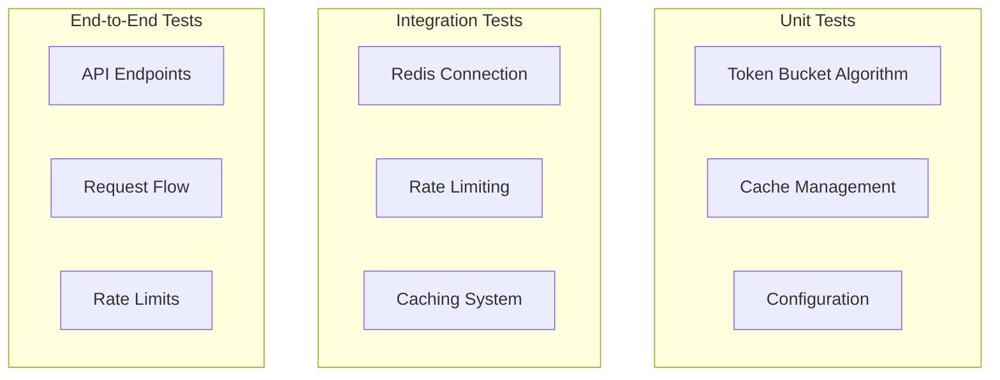

# Test Strategy: Redis Integration and Rate Limiting

## Test Architecture



## Test Categories

### 1. Unit Tests

#### Token Bucket Algorithm
- Bucket initialization
- Token consumption
- Refill mechanics
- Configuration validation
- Error conditions

#### Cache Management
- Cache key generation
- TTL handling
- Invalidation logic
- Memory limits
- Error scenarios

#### Configuration
- Environment validation
- Redis settings
- Rate limit rules
- Cache policies
- Connection pooling

### 2. Integration Tests

#### Redis Connection
```python
@pytest.fixture
def redis_client():
    return RedisTestClient(
        host=os.getenv("REDIS_HOST"),
        port=os.getenv("REDIS_PORT")
    )

def test_redis_connection(redis_client):
    assert redis_client.ping()
    assert redis_client.info()["connected_clients"] > 0
```

#### Rate Limiting
```python
@pytest.mark.integration
def test_rate_limiting():
    limiter = RateLimiter(redis_client)

    # Test normal flow
    assert limiter.check_limit("test_key")

    # Test limit exceeded
    for _ in range(MAX_REQUESTS):
        limiter.increment("test_key")
    assert not limiter.check_limit("test_key")
```

#### Caching System
```python
@pytest.mark.integration
def test_cache_operations():
    cache = CacheManager(redis_client)

    # Test set/get
    cache.set("test_key", "test_value")
    assert cache.get("test_key") == "test_value"

    # Test TTL
    assert cache.ttl("test_key") <= DEFAULT_TTL
```

### 3. Performance Tests

#### Load Testing
- Concurrent requests
- Token bucket performance
- Cache hit ratios
- Redis connection pool
- Memory usage patterns

#### Benchmarks
- Response times
- Cache latency
- Rate limit checks
- Redis operations
- Error handling

### 4. Reliability Tests

#### Failure Scenarios
- Redis connection loss
- Memory limits reached
- Network latency
- Configuration errors
- System overload

#### Recovery Testing
- Auto-reconnection
- Cache rebuilding
- Rate limit recovery
- Error propagation
- Circuit breaking

## Test Environment

### Local Development
```bash
# Start Redis container
docker run -d --name zabbix-cache-test \
  -p 6379:6379 \
  redis:alpine

# Run tests
pytest tests/ \
  --redis-host=localhost \
  --redis-port=6379
```

### CI Environment
```yaml
test:
  services:
    redis:
      image: redis:alpine
      ports:
        - 6379:6379
  script:
    - poetry install
    - pytest tests/ --cov=src
```

## Test Data

### Fixtures
- Rate limit configurations
- Cache entries
- Redis test data
- API responses
- Error scenarios

### Mock Objects
- Redis client mock
- API client mock
- Configuration mock
- Error handlers
- Time functions

## Success Criteria

### Coverage Requirements
- Unit tests: 90%+ coverage
- Integration tests: 80%+ coverage
- Critical paths: 100% coverage
- Error handlers: 100% coverage

### Performance Targets
- Response time < 100ms
- Cache hit ratio > 80%
- Rate limit checks < 10ms
- Error handling < 50ms
- Memory usage < 256MB

## Test Documentation

### Test Reports
- Coverage reports
- Performance metrics
- Error statistics
- Test scenarios
- Implementation notes

### Maintenance
- Regular test updates
- Performance monitoring
- Coverage tracking
- Documentation updates
- Test data refresh
