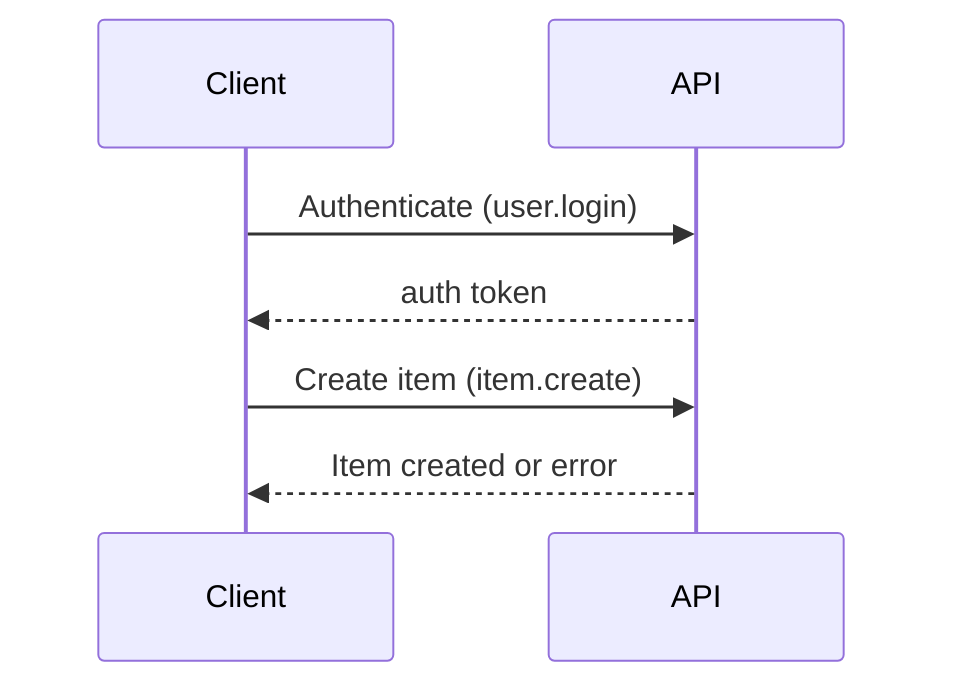
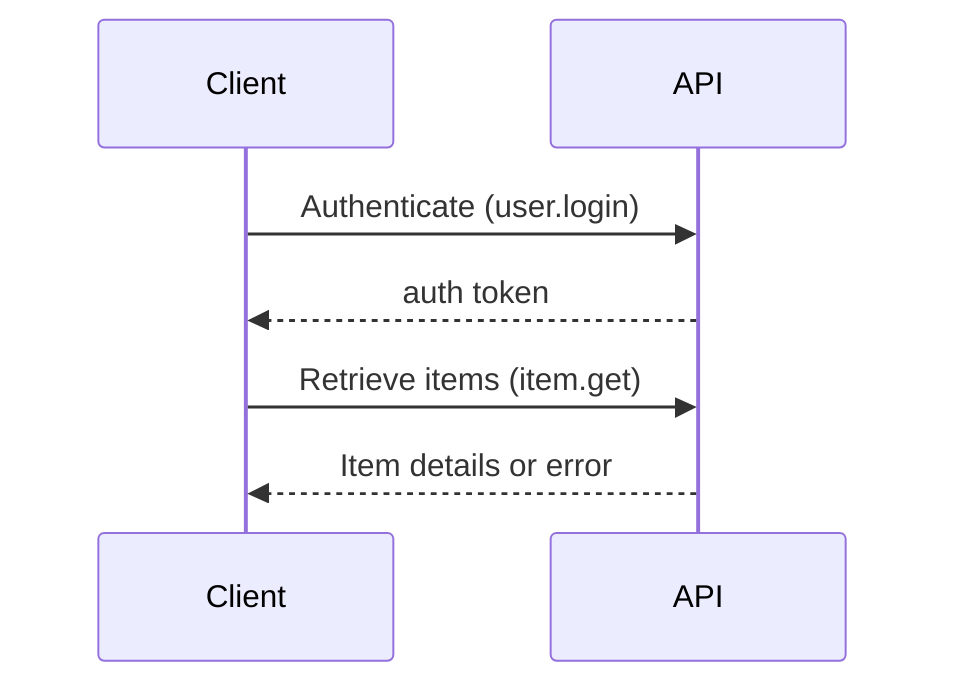

# Zabbix API Item and Items Documentation

## 1. Introduction

The Zabbix API provides RESTful interfaces for interacting programmatically with Zabbix server components, including Items which represent monitored metrics on hosts.

## 2. Authentication and Setup

To use the Zabbix API, you must authenticate via `user.login` method:

```json
{
  "jsonrpc": "2.0",
  "method": "user.login",
  "params": {
    "user": "api-username",
    "password": "api-password"
  },
  "id": 1
}
```

The response contains an authentication token (`auth`) required for subsequent requests.

## 3. Zabbix Item API Methods

### item.create
Creates a new monitoring item.

Example request:
```json
{
  "jsonrpc": "2.0",
  "method": "item.create",
  "params": {
    "name": "CPU Load",
    "key_": "system.cpu.load",
    "hostid": "10105",
    "type": 0,
    "value_type": 0,
    "interfaceid": "30005",
    "delay": "30s"
  },
  "auth": "auth_token",
  "id": 1
}
```

### item.get
Retrieves the details of items.

Example request:
```json
{
  "jsonrpc": "2.0",
  "method": "item.get",
  "params": {
    "output": "extend",
    "hostids": ["10105"],
    "search": {
      "key_": "cpu"
    }
  },
  "auth": "auth_token",
  "id": 1
}
```

### item.update
Updates an existing item.

Example request:
```json
{
  "jsonrpc": "2.0",
  "method": "item.update",
  "params": {
    "itemid": "23045",
    "delay": "1m"
  },
  "auth": "auth_token",
  "id": 1
}
```

### item.delete
Deletes items by their IDs.

Example request:
```json
{
  "jsonrpc": "2.0",
  "method": "item.delete",
  "params": ["23045"],
  "auth": "auth_token",
  "id": 1
}
```

## 4. Comprehensive Parameter Reference

| Parameter | Type | Required | Description |
|-----------|------|----------|-------------|
| name      | string | yes | Name of item |
| key_      | string | yes | Item's unique key |
| hostid    | string | yes | ID of host to monitor |
| type      | integer | yes | Type of the monitoring item |
| value_type| integer | yes | Data type of the item (numeric float, text, etc.) |
| interfaceid | string | conditional | Interface ID required for certain types |

## 5. Interaction Flows

### Creating items workflow:


### Retrieving items workflow:


## 6. Python MCP SDK Integration
Using MCP SDK with logging:
```python
import logging
from mcp import ZabbixClient

logging.basicConfig(level=logging.ERROR)

def create_item(client, params):
    logging.error('[Setup] Initializing Item creation...')
    try:
        response = client.call_method('item.create', params)
        logging.error(f'[API] Params: {params}')
        logging.error(f'[API] Response: {response}')
        return response
    except Exception as error:
        logging.error(f'[Error] Failed item creation: {str(error)}')
        raise
```

## 7. Best Practices
- Implement comprehensive logging.
- Robust error handling and recovery.

## 8. Troubleshooting Common Issues
- Verify authentication token validity.
- Check required parameters for each method call carefully.