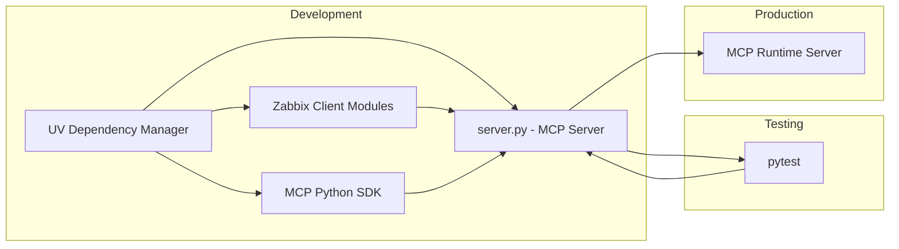

# Zabbix Server API - Project Management with UV

This document details setting up and managing the Python-based MCP (Model Context Protocol) project "zabbix-server-api" using the modern Python dependency management tool, **uv**.

---

## 📌 Requirements

- Python (3.8 or higher)
- Install UV:
```bash
pip install uv
# or via curl
curl -LsSf https://astral.sh/uv/install.sh | sh
```

---

## 🛠 Project Setup and Initialization

Create a virtual environment and dependencies lockfile:

```bash
cd zabbix-server-api
uv venv create .venv
source .venv/bin/activate
uv pip install -r requirements.txt
uv pip freeze > requirements-locked.txt
```

---

## 📦 Dependency Management

To add dependencies:

```bash
uv add "mcp[cli]" requests pydantic typing-extensions
```

To upgrade dependencies:

```bash
uv upgrade
```

---

## 📁 Project Structure & Logging Practices

Standard project layout:

```
zabbix-server-api/
├─ src/
│  ├─ client/
│  │  ├─ __init__.py
│  │  ├─ client.py
│  │  └─ trigger_client.py
│  ├─ models/
│  │  ├─ __init__.py
│  │  └─ host.py
│  ├─ protocol/
│  │  ├─ __init__.py
│  │  └─ api.py
│  └─ server.py                     
├─ tests/
│  ├─ __init__.py
│  ├─ test_client.py
│  ├─ test_host.py
│  └─ test_trigger_client.py
├─ requirements-locked.txt         
├─ uv.lock                         
├─ setup.py
└─ README.md
```

Example logging setup:

```python
import logging

logging.basicConfig(level=logging.INFO)
logger = logging.getLogger(__name__)

logger.info("[Setup] Server initializing...")
try:
    # server logic
    logger.info("[API] Request successful for '/endpoint'")
except Exception as e:
    logger.error(f"[Error] Server error: {str(e)}")
```

---

## ⚙️ MCP Server Configuration

Example `settings.json` configuration:

```json
{
  "mcpServers": {
    "zabbix-server-api": {
      "command": "python",
      "args": ["src/server.py"],
      "env": {
        "ZABBIX_API_KEY": "<your_zabbix_api_key>"
      },
      "disabled": false,
      "autoApprove": []
    }
  }
}
```

Install via MCP CLI:

```bash
mcp install src/server.py -v ZABBIX_API_KEY=<your_zabbix_api_key>
```

---

## 🧪 Testing and Validation

Install testing tools:

```bash
uv pip install pytest pytest-cov pytest-mock
```

Run tests:

```bash
pytest tests/ --cov=src/
```

Verify MCP Integration:

```bash
mcp start zabbix-server-api
```

---

## 📊 Workflow Diagram 



---

## 📖 Documentation Maintenance (UMB)

Keep memory bank docs updated regularly:

- `/memory-bank/activeContext.md` 
- `/memory-bank/productContext.md` 
- `/memory-bank/progress.md` 
- `/memory-bank/systemPatterns.md`

Updates via UMB keep this structured and valuable.

---

This document provides comprehensive guidelines for efficiently managing your Zabbix Server API MCP project using UV.